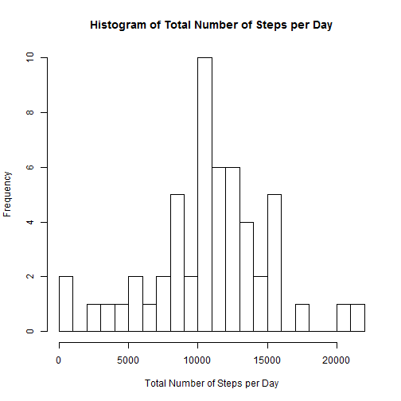
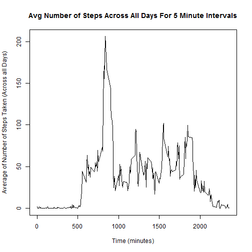
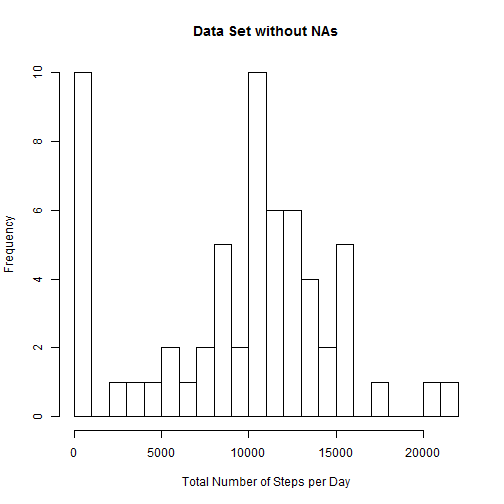
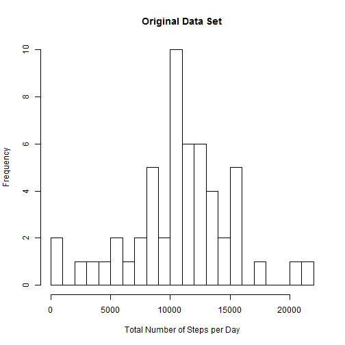
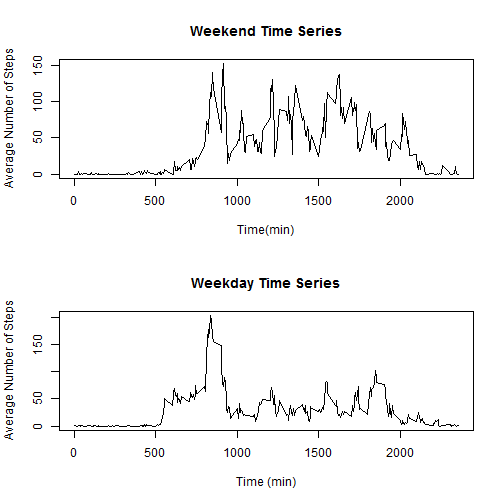

========================================================
 
# Reproducible Research Peer Assessment Assignment 1
## Written by: *Philip Coyne*
### Date: March 12, 2015
  
**Goal**:  For this assignment, we are given data that records and monitors an individuals steps.  This data has been taken from a monitoring device similar to Fitbit, Nike Fuelband, and Jawbone Up.  We are asked to process the raw data into a format acceptable for analysis, and to utilize that data to characterize the data through plots and results.

#### Part 1: Reading in the data
To begin, a link to the data, named "activity.csv" has been given and downloaded, and the following command was used to store the data into variable "stepData"


```r
stepData<-read.csv("activity.csv")
head(stepData)
```

```
##   steps       date interval
## 1    NA 2012-10-01        0
## 2    NA 2012-10-01        5
## 3    NA 2012-10-01       10
## 4    NA 2012-10-01       15
## 5    NA 2012-10-01       20
## 6    NA 2012-10-01       25
```

```r
tail(stepData)
```

```
##       steps       date interval
## 17563    NA 2012-11-30     2330
## 17564    NA 2012-11-30     2335
## 17565    NA 2012-11-30     2340
## 17566    NA 2012-11-30     2345
## 17567    NA 2012-11-30     2350
## 17568    NA 2012-11-30     2355
```

```r
class(stepData$steps)
```

```
## [1] "integer"
```

```r
class(stepData$date)
```

```
## [1] "factor"
```

```r
class(stepData$interval)
```

```
## [1] "integer"
```

The prompt for this assignment shows that the data contains three columns: "steps","date", and "interval".  The some step information is listed as "NA".  We see that each column is a different class.  Most notably, "date" is defined as a factor and will need to be adjusted properly for the next section.

#### Part 2: Determine the mean of the total number of steps  taken per day

To begin, the number of unique dates in "stepData" was taken and placed in variable "test".  The command "length(test)" was used to determine how many unique dates there are (61 dates).  


```r
test<-unique(stepData$date)
length(test)
```

```
## [1] 61
```

A 'for' loop was then utilized, in conjuction with the 'subset' function to sort through dates to determine the total number of steps for each day.  The variable "meanMedianStepData" was used to hold the results of this loop.  Four columns were used to hold dates, average number of steps for each day, the median number of steps for each day, and the total number of steps for each day.  Mean and median number of steps, while not neccessary to answer the assignment, were included for the sake of investigation.


```r
meanMedianStepData<-data.frame(matrix(ncol=4,nrow=length(test)))
meanMedianStepData[,1]<-test
meanMedianStepData[,1]<-as.Date(meanMedianStepData[,1])
for (i in 1:length(test)){

  data<-subset(stepData,test[i]==stepData$date)
  meanMedianStepData[i,2]<-mean(data$steps)
  meanMedianStepData[i,3]<-median(data$steps)
  meanMedianStepData[i,4]<-sum(data$steps)
}

colnames(meanMedianStepData)<-c("Date","Mean","Median","Total")

head(meanMedianStepData)
```

```
##         Date     Mean Median Total
## 1 2012-10-01       NA     NA    NA
## 2 2012-10-02  0.43750      0   126
## 3 2012-10-03 39.41667      0 11352
## 4 2012-10-04 42.06944      0 12116
## 5 2012-10-05 46.15972      0 13294
## 6 2012-10-06 53.54167      0 15420
```

A histogram for the total number of steps taken for each day was asked for this section of the assignment.  The below R code provides such a histogram:


```r
hist(meanMedianStepData$Total,breaks=20,xlab="Total Number of Steps per Day", main="Histogram of Total Number of Steps per Day")
```

 

After obtaining this histogram, it was asked to provide the mean and median of the total number of steps taken per day.  Given the wording, it was assumed that this would be the average of the "Total" column of the variable"meanMedianStepData", as well as the median of the same column.  It should be noted that NA values were removed for this part of the assignment with the use of "na.rm=TRUE".


```r
totalStepAvg<-mean(meanMedianStepData$Total,na.rm=TRUE)
totalStepMedian<-median(meanMedianStepData$Total,na.rm=TRUE)
totalStepAvg
```

```
## [1] 10766.19
```

```r
totalStepMedian
```

```
## [1] 10765
```

*The average of the total number of steps taken per day is* **10766.19**.  *The median of the total number of steps per day is* **10765**.


#### Part 3: What is the average daily activity pattern?
Next it was asked to construct a time series plot of the 5 minute intervals given in the "interval" column of "stepData".  The following R code was utilized to construct a time series plot for the data.


```r
newTest<-unique(stepData$interval)

intervalStepData<-data.frame(matrix(ncol=2,nrow=length(newTest)))

intervalStepData[,1]<-newTest

for (i in 1:length(newTest)){
  
  data<-subset(stepData,newTest[i]==stepData$interval)
  intervalStepData[i,2]<-mean(data$steps,na.rm=TRUE)
  
}
colnames(intervalStepData)<-c("interval","Avg Steps")
##Determine maximum number of steps


plot(intervalStepData[,1],intervalStepData[,2],type="l",xlab="Time (minutes)",ylab="Average of Number of Steps Taken (Across all Days)",main="Avg Number of Steps Across All Days For 5 Minute Intervals")
```

 


```r
max(intervalStepData[,2])
```

```
## [1] 206.1698
```

```r
which(intervalStepData[,2]==max(intervalStepData[,2]))
```

```
## [1] 104
```

```r
intervalStepData[104,]
```

```
##     interval Avg Steps
## 104      835  206.1698
```
*The maximum average number of steps taken across all days appears to be* **206.1698** *steps at the time interval of* **835 minutes**.


#### Part 4:  Input missing values

It is asked to determine the total number of missing values from the original dataset, located in "stepData".  This is done by using the function 'is.na' with "stepData" and storing the results into "indexMissing", *the results are then summed up to give* **2,304** *missing entries*.  


```r
indexMissing<-is.na(stepData$steps)
sum(indexMissing)
```

```
## [1] 2304
```

Given the number of missing entries, the question of whether there were entire days of entries missing, or if it was random and sporadic.  To answer this issue, days that were completely omitted from the original data set were given were replaced with 0 steps for every interval.  


```r
test<-unique(stepData$date)
length(test)
```

```
## [1] 61
```

```r
experimentalStepData<-data.frame(matrix(ncol=3,nrow=0))
colnames(experimentalStepData)<-c("steps","date","interval")

for(i in 1:length(test)){
  
  data<-subset(stepData,test[i]==stepData$date)
  conditionalMean<-mean(data$steps)
  query<-is.na(data$steps)
  sum(query)
  
  ##If the entire day is NA, set all steps to 0
  if(is.na(conditionalMean)==TRUE){
    data$steps<-0
  }
  
  
  experimentalStepData<-rbind(experimentalStepData,data)
}
```

It was reasoned that the 'if' statement will find days where there are no recorded "steps" entries and replace those NAs with 0.  Afterwards the following R code was run to determine how many NAs were left in the data set.  


```r
query<-is.na(experimentalStepData$steps)
sum(query)
```

```
## [1] 0
```

The result from summing query gives a result of 0, indicating that there are no longer any NAs in the data set.  The next concern is if the new data set of "experimentalStepData" is the same size as the original data set "stepData".  The following R code was run to determine this


```r
dim(experimentalStepData)
```

```
## [1] 17568     3
```

```r
dim(stepData)
```

```
## [1] 17568     3
```

This shows that both data sets have the same number of entries and columns, except experimentalStepData has no missing values.  

Afterwards we set up a histogram of the total number of steps taken each day and find the mean and median of the total number of steps taken per day.  Additionally the total mean and median of these time intervals were taken and stored into the variables seen below:


```r
experimentalMeanStepData<-data.frame(matrix(ncol=2,nrow=length(test)))
experimentalMeanStepData[,1]<-test
experimentalMeanStepData[,1]<-as.Date(experimentalMeanStepData[,1])


for (i in 1:length(test)){
  
  data<-subset(experimentalStepData,test[i]==experimentalStepData$date)
  experimentalMeanStepData[i,2]<-sum(data$steps)
}

colnames(experimentalMeanStepData)<-c("Date","Total")


##Create histogram of the total number of steps. Compare to 
##the previous histogram in the first part of the assignment
hist(experimentalMeanStepData$Total,breaks=20,main="Data Set without NAs",xlab="Total Number of Steps per Day")
```

 

```r
hist(meanMedianStepData$Total,breaks=20,main="Original Data Set", xlab="Total Number of Steps per Day")
```

 

```r
mean(experimentalMeanStepData$Total)
```

```
## [1] 9354.23
```

```r
median(experimentalMeanStepData$Total)
```

```
## [1] 10395
```
The mean and median of "experimentalMeanStepData", which holds the new data set, resulted in **9354.23** and **10395** respectively.  Compared to the original data set which had **10766.19** and **10765** for the mean and median, respectively.  It's likely that including zeros brings the mean down and shifts the median a bit, since entries that were previously ignored are now considered. 


#### Part 5: Determining differences in activity patterns between weekdays and weekends

We now consider the difference between weekday and weekend activity.  To start, the use of the 'weekdays()' function was considered.  For this section, a new variable was created to hold the data, found in 'experimentalStepData' and named 'newESD'.


```r
newESD<-experimentalStepData
newESD$date<-as.Date(newESD$date)
newESDColumn<-weekdays(newESD$date)
newESD["Weekday"]<-newESDColumn
head(newESD)
```

```
##   steps       date interval Weekday
## 1     0 2012-10-01        0  Monday
## 2     0 2012-10-01        5  Monday
## 3     0 2012-10-01       10  Monday
## 4     0 2012-10-01       15  Monday
## 5     0 2012-10-01       20  Monday
## 6     0 2012-10-01       25  Monday
```
The 'weekday()' looks at the dates provided and determines what day of the week they fall on.  After doing this processing of data, a similar method to sort and seperate the interval data was conducted.  For loops were used to sort through the interval data and construct time series plots for both the weekdays and weekends.  


```r
newTest<-unique(newESD$interval)

newIntESD<-data.frame(matrix(ncol=2,nrow=length(newTest)))

newIntESD[,1]<-newTest

newWeekDayIntESD<-newIntESD
newWeekEndIntESD<-newIntESD 

##Sort Weekday and Weekend dates

weekdayIntESD<-data.frame(matrix(ncol=4,nrow=0))
weekendIntESD<-data.frame(matrix(ncol=4,nrow=0))

colnames(weekdayIntESD)<-c("steps","date","interval","Weekday")
colnames(weekendIntESD)<-c("steps","date","interval","Weekday")

sunday<-subset(newESD,newESD$Weekday=="Sunday")  
saturday<-subset(newESD,newESD$Weekday=="Saturday")  
monday<-subset(newESD,newESD$Weekday=="Monday")  
tuesday<-subset(newESD,newESD$Weekday=="Tuesday")  
wednesday<-subset(newESD,newESD$Weekday=="Wednesday")  
thursday<-subset(newESD,newESD$Weekday=="Thursday")  
friday<-subset(newESD,newESD$Weekday=="Friday")  

weekdayIntESD<-rbind(monday,tuesday,wednesday,thursday,friday)
weekendIntESD<-rbind(sunday,saturday)


##Weekday Intervals 
for (i in 1:length(newTest)){
  
  data<-subset(weekdayIntESD,newTest[i]==weekdayIntESD$interval)
  newWeekDayIntESD[i,2]<-mean(data$steps)
  
}


##Weekend Intervals

for (i in 1:length(newTest)){
  
  data<-subset(weekendIntESD,newTest[i]==weekendIntESD$interval)
  newWeekEndIntESD[i,2]<-mean(data$steps)
  
}


##Display panel plot

par(mfrow=c(2,1))

plot(newWeekEndIntESD[,1],newWeekEndIntESD[,2],type="l",main="Weekend Time Series", xlab="Time(min)",ylab="Average Number of Steps")

plot(newWeekDayIntESD[,1],newWeekDayIntESD[,2],type="l",main="Weekday Time Series",xlab="Time (min)",ylab="Average Number of Steps")
```

 

**We see that there is significantly higher activity during the weekdays than the weekends.**

